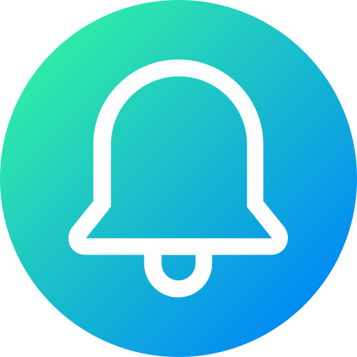

# Custom Reminders

<p align="center">
  
</p>

	<p align="center">
	  <a href="https://github.com/Tyomich4736/Custom-Reminders-Zepp-OS-App/stargazers"
	    ></a>
	  <a href="https://github.com/Tyomich4736/Custom-Reminders-Zepp-OS-App/issues"
	    ></a>
	  <a href="https://github.com/Tyomich4736/Custom-Reminders-Zepp-OS-App/blob/main/LICENSE"
	    ></a>
	  <a
	    href="https://github.com/Tyomich4736/Custom-Reminders-Zepp-OS-App/actions/workflows/ci.yml"
	    ></a>
	</p>

A Zepp OS watch app for creating repeating reminders with a title, description, weekday schedule, and time. Reminders are stored on the device and delivered through system notifications when an alarm fires.

Built for **Amazfit Balance 2** (round 480×480, Zepp OS 4.x).

## Features

- Create and edit reminders on the watch (no phone companion required)
- Title and optional description
- Pick time and weekdays (Mon–Sun)
- Persistent weekly alarms via `@zos/alarm`
- System notification when a reminder is due
- Local storage only — data stays on the device

## How it works

```text
Home list  →  Edit page  →  save to local file + schedule alarm
                                    ↓
                         @zos/alarm wakes App Service
                                    ↓
                         @zos/notification shows alert
```

1. Reminders are saved to device storage as JSON.
2. On save, a persistent weekly alarm is scheduled for the next matching day/time.
3. When the alarm fires, `app-service/reminder` runs and posts a system notification.

## Requirements

- [Node.js](https://nodejs.org/) 14+ (LTS recommended)
- [Zeus CLI](https://docs.zepp.com/docs/guides/tools/cli/) (`@zeppos/zeus-cli`)
- Zepp OS simulator and/or a compatible watch
- Zepp App with **Developer Mode** enabled (for on-device preview)

### Compatible devices

Configured target in `app.json`:

| Device | Design | API |
| --- | --- | --- |
| Amazfit Balance 2 | Round, 480×480 | Zepp OS 4.0–5.0 |

Other round 480px Zepp OS 4 devices may work with small `app.json` platform tweaks.

## Getting started

```bash
# Install Zeus CLI (once)
npm i @zeppos/zeus-cli -g

# Clone and install dependencies
git clone https://github.com/Tyomich4736/Custom-Reminders-Zepp-OS-App.git
cd Custom-Reminders-Zepp-OS-App
npm install
```

### Simulator preview

```bash
zeus dev
```

Start the Zepp OS simulator first and enable the device simulator.

### Install on a watch

```bash
zeus preview
```

Scan the QR code with the Zepp App Developer Mode scanner.

### Build a package

```bash
zeus build
```

The `.zab` installer is written to `dist/`.

## Project structure

```text
├── app.js                 # App entry
├── app.json               # App config, permissions, device targets
├── app-service/
│   └── reminder.js        # Alarm wake-up → notification
├── page/
│   ├── home/              # Reminder list
│   ├── edit/              # Create / edit form
│   └── i18n/              # Strings (en-US)
├── utils/
│   ├── alarm.js           # Schedule / cancel weekly alarms
│   ├── reminders.js       # CRUD + formatting
│   ├── fs.js              # Local file persistence
│   └── constants.js
└── assets/gt/             # Icons for the gt (round) target
```

## Permissions

Declared in `app.json`:

| Permission | Purpose |
| --- | --- |
| `device:os.alarm` | Schedule repeating reminders |
| `device:os.notification` | Show alerts when due |
| `device:os.local_storage` | Persist reminders on device |
| `data:os.device.info` | Screen size / device info for layout |

## Development notes

- **App ID** — `app.json` includes an `appId`. For your own distribution, register an app on the [Zepp Developer Platform](https://developer.zepp.com/) and replace that ID.
- **Language** — UI strings live in `page/i18n/en-US.po`. Add more `.po` files for other locales.
- **Time zones** — Alarm times are computed from the watch’s local clock and converted to the UTC timestamps expected by `@zos/alarm`.
- **Formatting** — Run `npm run format` before committing.

## Contributing

Contributions are welcome! Please read [CONTRIBUTING.md](CONTRIBUTING.md) and our [Code of Conduct](CODE_OF_CONDUCT.md) first.

Quick start for contributors:

```bash
npm install
npm run format:check   # lint
zeus dev               # simulator preview
zeus build             # produce .zab
```

## Changelog

See [CHANGELOG.md](CHANGELOG.md) for release notes.

## License

This project is released under the [ISC License](LICENSE).
